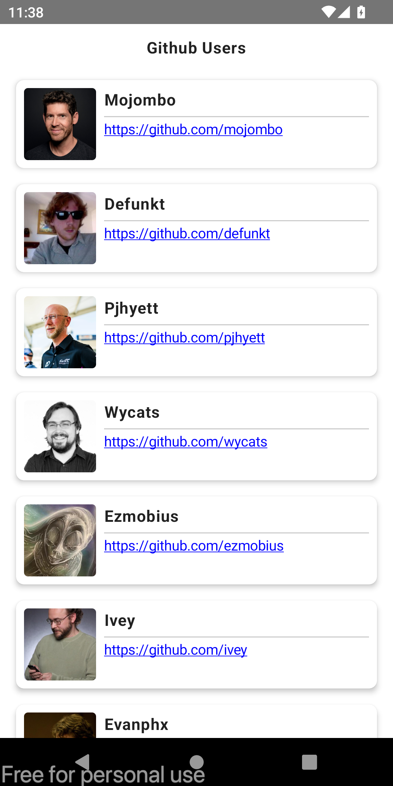
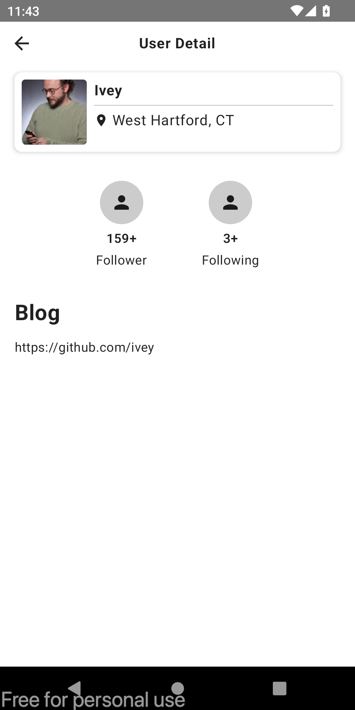
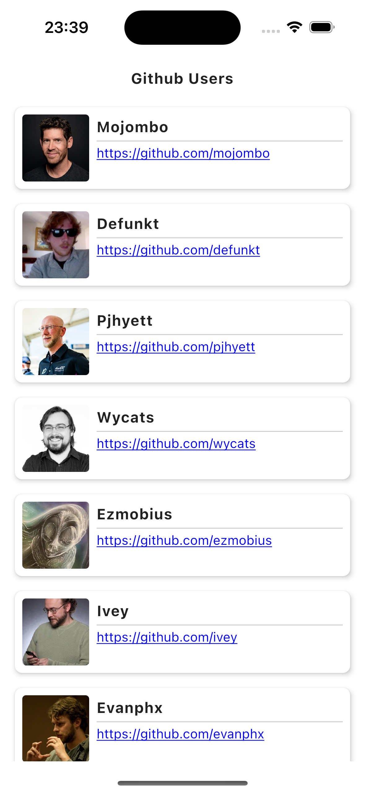

# App Name: TymeX Home Test

## Introduction
This project is a basic app built as part of a coding test. It demonstrates my ability to design, develop, and implement key features from scratch using `Compose Multiplatform`.

## Features
- Fetch the Github users's information.
- Load more.
- Caching response.
- See the user details.
- Unit Tests.

## Technologies Used
- Compose Multiplatform, Coroutines, ViewModel Compose, Navigation Compose
- Network: Ktor, Serialization, Kachetor (persistent cache)
- DI: Koin
- Async Image: Coil3

## Architecture
This app follows the MVVM + Clean Architecture pattern for:
- Separation of concerns
- Scalability
- Ease of testing

Key Layers:
- **Presentation Layer**: Handles UI components.
- **Data Layer**: Manages data sources and repositories.
- **Domain Layer**: Encapsulates business logic.

## Screenshots

### Android:

  
  

### iOS:

  
  

